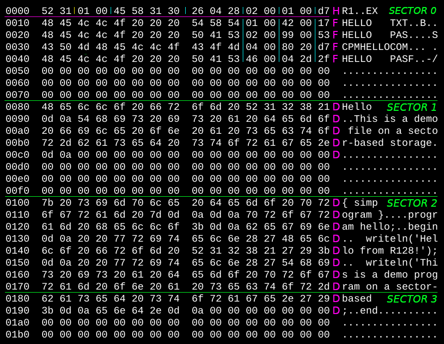
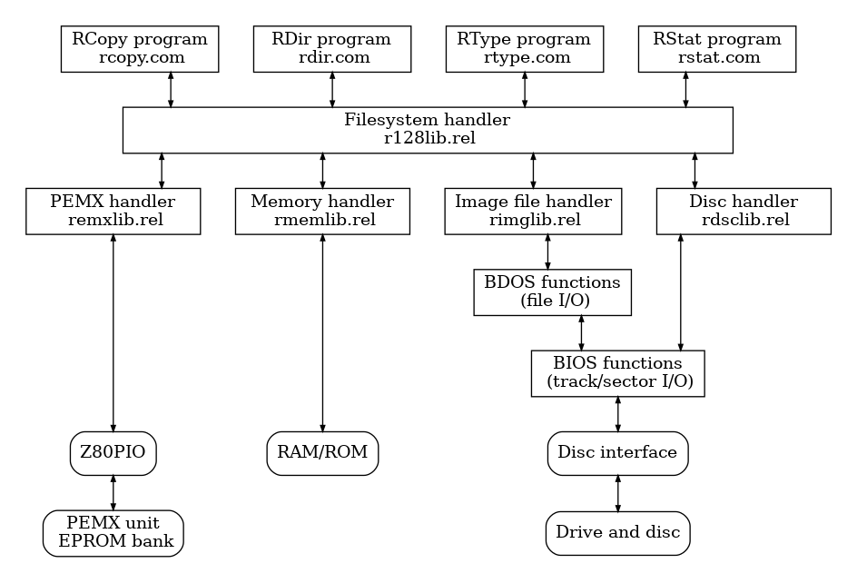
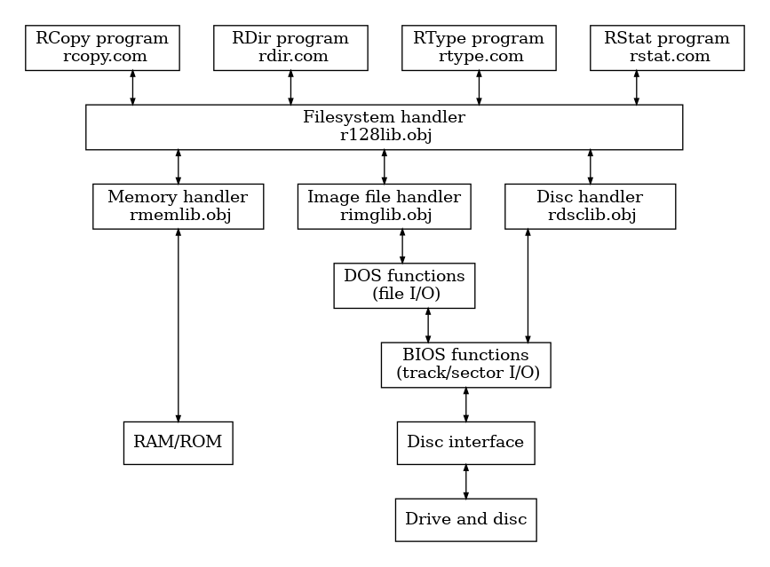

# R128

**128 byte sector-based ROM filesystem**  

## Used terms

- **medium** : The physical storage device that holds the filesystem (e.g.
  EPROM, floppy, ROM image, memory area).
- **sector**: The logical block unit of the filesystem; fixed size 128 bytes.
- **offset**: The offset is the starting position of a given data or structure
  on the medium, expressed in bytes from the beginning of the medium.
- **entry area**: The contiguous region that stores header and all file entries.  
  The entry area starts at sector 0, offset 10h and contains the header and all
  file entries.
- **header**: The header is the first 16 bytes of the file system, which
  contains the basic metadata needed to identify the file system and define its
  structure (entry area and data area).  
  Located at: sector 0, offset 00h, length 16 bytes.
  - **HDMAWO**: Identifies the filesystem and validates the medium, length 2 bytes.
  - **HDVERS**: Filesystem format version, length 2 bytes.
  - **HDCHID**: Identifier of the programmed ROM or build/version, length 4 bytes.
  - **HDBUDA**: Programming date encoded in BCD, length 3 bytes.
  - **HDNESE**: Number of sectors used by the entry area, length 2 bytes.
  - **HD1DSE**: Index of the first data sector, length 2 bytes.
  - **HDENCS**: Checksum of the header, MOD 256 type, length 1 byte.
- **file entry**: A fixed-size record in the entry area that describes the name,
  location, and size of a file.  
  1st entry at: sector 0, offset 10h, length 16 bytes.
  - **FLNAME**: File name in 8.3 format, length 11 bytes.
  - **FL1SEC**: First sector of the file data, length 2 bytes.
  - **FLSIZE**: File size in sector count, length 2 bytes.
  - **FLENCS**: Checksum of this file entry, MOD 256 type, length 1 byte.
- **data area**: Starts at sector defined by **HD1DSE**. Contains file data
  stored contiguously. Length is determined implicitly from total medium size.

## 1. Concept

**Goal:** A compact ROM file system with deterministic lookup and contiguous
storage, optimized for minimal runtime overhead.

## 2. Characteristics

The medium consists of an entry area and a data area, one after the other. Their
size depends on the amount and size of the stored content.

### Theoretical storage limits

- _Minimum media size_:
  - empty filesystem: 128 bytes (1 sector),
  - with data: 256 bytes (2 sector).
- _Maximum media size_: 8388608 bytes (65536 sector).
- _Maximum number of minimally sized files (128 B) that can be stored_: 58253 pcs.
- _Maximum file size_ (single file occupying the entire disk): 8388480 bytes.

### Map of the filesystem

**Entry area**  

```text
0000h ─┬─ sector #0
       ├─ +00h HDMAWO  entry #0: header
       ├─ +02h HDVERS
       ├─ +04h HDCHID
       ├─ +08h HDBUDA
       ├─ +0Bh HDNESE
       ├─ +0Dh HD1DSE
       ├─ +0Fh HDENCS
0010h ─┼─ +10h FLNAME  entry #1: file entry
       ├─ +1Bh FL1SEC
       ├─ +1Dh FLSIZE
       ├─ +1Fh FLENCS
       :
0070h ─┼─ +70h FLNAME  entry #7: file entry
       ├─ +7Bh FL1SEC
       ├─ +7Dh FLSIZE
       ├─ +7Fh FLENCS
0080h ─┼─
       :
```

**If sector #1 is in the entry area**  

```text
        :
0080h ──┼── sector #1
        ├─ +00h FLNAME  entry #8: file entry
        ├─ +0Bh FL1SEC
        ├─ +0Dh FLSIZE
        ├─ +0Fh FLENCS
0090h ──┼─ +10h FLNAME  entry #9: file entry
        ├─ +1Bh FL1SEC
        ├─ +1Dh FLSIZE
        ├─ +1Fh FLENCS
        :
00F0h ──┼─ +70h FLNAME  entry #15: file entry
        ├─ +7Bh FL1SEC
        ├─ +7Dh FLSIZE
        ├─ +7Fh FLENCS
0100h ──┼──
        :
```

**If sector #1 is in the data area**  

```text
        :
0080h ──┼── sector #1
        ├─ The 0th byte of the file.
        :
        ├─ The 127th byte of the file.
0100h ──┼──
        :
```

## 3. Example filesystem

This directory demonstrates how to build and populate a minimal filesystem image
across multiple platforms. The following files are located in the `example`
directory.

**Build tools (per platform)**  

Each platform provides a script and corresponding assembly source to generate
the file entry binary:

- `dos/build.bat` – builds the file entry binary on DOS
- `dos/r128ex.asm` – DOS assembly source
- `linux/build` – builds the file entry binary on Linux
- `linux/r128ex.s` – Linux assembly source
- `cpm/build.sub` – builds the file entry binary on CP/M
- `cpm/r128ex.z80` – CP/M assembly source

**Example content**  

Sample files used to populate the filesystem image:

- `content/hello.txt`
- `content/hello.pas`
- `content/cpmhello.com`
- `content/doshello.com`

**Utility scripts**  

- `insdata` – inserts files from the `content` directory into the image (Bash)
- `mkimages` – creates empty images and embeds the file entry binary (Bash)
- `dump` - parameterized, filtered hexdump  (Bash)

**Generated outputs**  

- `r128ex.bin` – compiled file entry structure in binary form
- `r128exrm.img(.gz)` – resulting EPROM image
- `r128exfd.img(.gz)` – resulting 1.44 MB floppy disk image



**Notes:**  

- _green line and text_: sector separator and sectorname
- _pink line_: header and file entries separator in entry area
- _pink letter_: H: header entry, F: file entries, D: file data.
- _cyan_: partial separator in entries.

The libraries' own README.md provides information about the compiler and linker
that can be used for compilation.

## 4. Libraries and utilities

The `library` directory contains the core filesystem implementation and the
device-specific block drivers. The `utility` directory contains utilities for
accessing the R128 file system.

**CP/M (8080 and Z80)**  



- `library/cpm*/r128lib.*` – the R128 filesystem core library
- `library/cpm*/rdsclib.*` – disc-based block device driver
- `library/cpm*/rimglib.*` – image file–based block device driver
- `library/cpm*/rmemlib.*` – memory–based block device driver
- `library/cpm*/remxlib.*` – block device driver for External Memory Box (PEMX)

- `utility/cpm*/rcopy.*` – copies a file from the R128 to the host filesystem
- `utility/cpm*/rdir.*`  – lists files in the R128 filesystem
- `utility/cpm*/rtype.*` – outputs the contents of a file from the R128
- `utility/cpm*/rstat.*` – displays filesystem information

**DOS (8088)**  



- `library/dos-8088/r128lib.*` – the R128 filesystem core library
- `library/dos-8088/rdsclib.*` – disc-based block device driver
- `library/dos-8088/rimglib.*` – image file–based block device driver
- `library/dos-8088/rmemlib.*` – memory–based block device driver

- `utility/dos-8088/rcopy.*` – copies a file from the R128 to the host filesystem
- `utility/dos-8088/rdir.*`  – lists files in the R128 filesystem
- `utility/dos-8088/rtype.*` – outputs the contents of a file from the R128
- `utility/dos-8088/rstat.*` – displays filesystem information

The libraries' own README.md provides information about the compiler and linker
that can be used for compilation.

## 5. Licence

This is a free software: you can redistribute it and/or modify it under the
terms of the MIT License.
